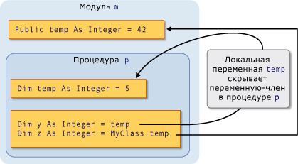
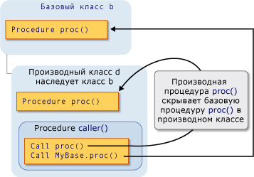

# Сокрытие в Visual Basic
[!INCLUDE[vs2017banner](../../../../csharp/includes/vs2017banner.md)]

Если два программных элемента имеют общее имя, один из них может скрыть, или *затенить* другой.  В такой ситуации затененный элемент недоступен для обращения. При использовании в коде имени элемента компилятор [!INCLUDE[vbprvb](../../../../csharp/programming-guide/concepts/linq/includes/vbprvb_md.md)] обращается к затеняющему элементу.  
  
## Назначение  
 Цель затенения — защита определения членов класса.  Базовый класс может подвергнуться изменениям, при которых будет создан элемент, имя которого совпадает с ранее определенным элементом.  Если это так, то при применении модификатора `Shadows` в классе используются ссылки на ранее определенный, а не на новый член базового класса.  
  
## Типы затенения  
 Один элемент может затенить другой двумя разными способами.  Затеняющий элемент может быть объявлен внутри подобласти области кода, содержащей затеняемый элемент. В таком случае затенение происходит посредством *области действия*.  Или производный класс может переопределить член базового класса, тогда затенение происходит *посредством наследования*.  
  
### Затенение через область действия  
 Программные элементы в одном модуле, классе или структуре могут иметь одно имя, но разные области действия.  Если два элемента объявляются таким образом и код обращается к их общему имени, элемент с более узкой областью действия затеняет второй элемент \(наиболее узкая область действия — уровень блока\).  
  
 Например, модуль может определить переменную `Public` с именем `temp`, и процедура в модуле может объявить локальную переменную тоже с именем `temp`.  Ссылки на `temp` из процедуры получат доступ к локальной переменной, а ссылки на `temp` вне процедуры — к переменной `Public`.  В этом случае переменная процедуры `temp` затеняет переменную модуля `temp`.  
  
 Ниже показаны две переменные, обе с именем `temp`.  Локальная переменная `temp` затеняет переменную\-член `temp` при доступе из своей собственной процедуры `p`.  Тем не менее, ключевое слово `MyClass` обходит затенение и обращается к переменной\-члену.  
  
   
Затенение посредством области действия  
  
 Пример затенения посредством области действия содержится в разделе [Практическое руководство. Сокрытие переменной с тем же именем, что и ваша переменная](../../../../visual-basic/programming-guide/language-features/declared-elements/how-to-hide-a-variable-with-the-same-name-as-your-variable.md).  
  
### Затенение через наследование  
 Если производный класс переопределяет программный элемент, наследуемый от базового класса, переопределенный элемент затеняет первоначальный.  Объявленный элемент или набор перегруженных элементов любого типа может быть затенен элементом любого типа.  Например, переменная `Integer` может затенить процедуру `Function`.  При затенении одной процедуры другой можно использовать другой список параметров и другой тип возвращаемого значения.  
  
 Следующий пример показывает базовый класс `b` и производный класс `d`, наследуемый от `b`.  Процедура с именем `proc`, определенная в базовым классе, затеняется процедурой производного класса с тем же именем.  Первый оператор `Call` обращается к затеняющей `proc` в производном классе.  Однако ключевое слово `MyBase` обходит затенение и обращается к затененной процедуре в базовом классе.  
  
   
Затенение посредством наследования  
  
 Пример затенения посредством наследования содержится в разделах [Практическое руководство. Сокрытие переменной с тем же именем, что и ваша переменная](../../../../visual-basic/programming-guide/language-features/declared-elements/how-to-hide-a-variable-with-the-same-name-as-your-variable.md) и [Практическое руководство. Сокрытие наследуемой переменной](../../../../visual-basic/programming-guide/language-features/declared-elements/how-to-hide-an-inherited-variable.md).  
  
#### Затенение и уровень доступа  
 Затеняющий элемент не всегда доступен из кода производного класса.  Например, он может быть объявлен `Private`.  В таком случае затенение нарушается и компилятор разрешает все ссылки на элементы, как если бы затенения не существовало.  Это элемент в наименьшем количестве последовательных шагов от затеняющего класса.  Если затененный элемент — процедура, то решением является ближайший доступный элемент с таким же именем, списком параметров и типом возвращаемого значения.  
  
 В следующем примере показана иерархия наследования из трех классов.  Каждый класс определяет процедуру `Sub` `display`, и каждый производный класс затеняет процедуру `display` базового класса.  
  
```  
Public Class firstClass  
    Public Sub display()  
        MsgBox("This is firstClass")  
    End Sub  
End Class  
Public Class secondClass  
    Inherits firstClass  
    Private Shadows Sub display()  
        MsgBox("This is secondClass")  
    End Sub  
End Class  
Public Class thirdClass  
    Inherits secondClass  
    Public Shadows Sub display()  
        MsgBox("This is thirdClass")  
    End Sub  
End Class  
Module callDisplay  
    Dim first As New firstClass  
    Dim second As New secondClass  
    Dim third As New thirdClass  
    Public Sub callDisplayProcedures()  
        ' The following statement displays "This is firstClass".  
        first.display()  
        ' The following statement displays "This is firstClass".  
        second.display()  
        ' The following statement displays "This is thirdClass".  
        third.display()  
    End Sub  
End Module  
```  
  
 В предыдущем примере производный класс `secondClass` затеняет `display` процедурой `Private`.  Когда модуль `callDisplay` вызывает `display` в `secondClass`, вызывающий код находится за пределами `secondClass` и, таким образом, не может получить доступ к частной процедуре `display`.  Затенение нарушается, и компилятор разрешает ссылку на процедуру `display` базового класса.  
  
 Однако дополнительный производный класс `thirdClass` объявляет `display` как `Public`, поэтому код в `callDisplay` имеет к ней доступ.  
  
## Затенение и переопределение  
 Не следует путать затенение с переопределением.  И то и другое используется при наследовании производного класса от базового, и то и другое замещает один объявленный элемент другим.  Но между этими двумя понятиями существуют значительные различия.  Сравнение содержится в разделе [Различия между сокрытием и переопределением](../../../../visual-basic/programming-guide/language-features/declared-elements/differences-between-shadowing-and-overriding.md).  
  
## Затенение и перегрузка  
 При затенении одного элемента базового класса несколькими элементами производного класса затеняющие элементы становятся перегруженными.  Дополнительные сведения см. в разделе [Перегрузка процедур](../../../../visual-basic/programming-guide/language-features/procedures/procedure-overloading.md).  
  
## Доступ к затененным элементам  
 Обращение к элементу производного класса обычно происходит через текущий экземпляр этого класса с уточнением имени элемента путем указания ключевого слова `Me`.  Если производный класс затеняет элемент базового класса, к элементу можно обратиться, указав ключевое слово `MyBase`.  
  
 Пример доступа к затененному элементу содержится в разделе [Практическое руководство. Доступ к переменной, скрытой производным классом](../../../../visual-basic/programming-guide/language-features/declared-elements/how-to-access-a-variable-hidden-by-a-derived-class.md).  
  
### Объявление переменной объекта  
 Создание переменной объекта также может влиять на то, как производный класс обращается к затеняющему или затененному элементу.  В следующем примере создается два объекта производного класса, но один объект объявлен как базовый класс, а другой в качестве производного класса.  
  
```  
Public Class baseCls  
    ' The following statement declares the element that is to be shadowed.  
    Public z As Integer = 100  
End Class  
Public Class dervCls  
    Inherits baseCls  
    ' The following statement declares the shadowing element.  
    Public Shadows z As String = "*"  
End Class  
Public Class useClasses  
    ' The following statement creates the object declared as the base class.  
    Dim basObj As baseCls = New dervCls()  
    ' Note that dervCls widens to its base class baseCls.  
    ' The following statement creates the object declared as the derived class.  
    Dim derObj As dervCls = New dervCls()  
    Public Sub showZ()   
    ' The following statement outputs 100 (the shadowed element).  
        MsgBox("Accessed through base class: " & basObj.z)  
    ' The following statement outputs "*" (the shadowing element).  
        MsgBox("Accessed through derived class: " & derObj.z)  
    End Sub  
End Class  
```  
  
 В предыдущем примере переменная `basObj` объявляется как базовый класс.  Доступ к объекту `dervCls` реализует расширяющее преобразование и, соответственно, допустимо.  Однако базовый класс не может получить доступ к затеняемой версии переменной `z` в производном классе, поэтому компилятор разрешает `basObj.z` к исходному значению базового класса.  
  
## См. также  
 [Ссылки на объявленные элементы](../../../../visual-basic/programming-guide/language-features/declared-elements/references-to-declared-elements.md)   
 [Область видимости в Visual Basic](../../../../visual-basic/programming-guide/language-features/declared-elements/scope.md)   
 [Расширяющие и сужающие преобразования](../../../../visual-basic/programming-guide/language-features/data-types/widening-and-narrowing-conversions.md)   
 [Shadows](../../../../visual-basic/language-reference/modifiers/shadows.md)   
 [Overrides](../../../../visual-basic/language-reference/modifiers/overrides.md)   
 [Me, My, MyBase и MyClass](../../../../visual-basic/programming-guide/program-structure/me-my-mybase-and-myclass.md)   
 [Основы наследования](../../../../visual-basic/programming-guide/language-features/objects-and-classes/inheritance-basics.md)